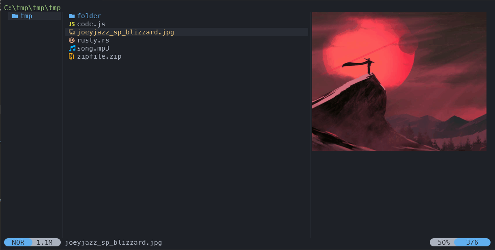

<div align="center">
  
</div>

<h3 align="center">
	OneDark Yazi Flavor
</h3>


## 👀 Preview



## 🎨 Installation


```sh
ya pack -a damjee/onedark
```

## ⚙️ Usage

<!--
If your flavor uses a light color scheme, use "light" instead of "dark" wherever it appears below.
-->

To set it as your dark flavor, change the content of your `theme.toml` to:

```toml
[flavor]
dark = "example"
```

Make sure your `theme.toml` doesn't contain anything other than `[flavor]`, unless you want to override certain styles of this flavor.

See the [Yazi flavor documentation](https://yazi-rs.github.io/docs/flavors/overview) for more details.

## 📜 License

The flavor is MIT-licensed.

Check the [LICENSE](LICENSE) and [LICENSE-tmtheme](LICENSE-tmtheme) file for more details.
